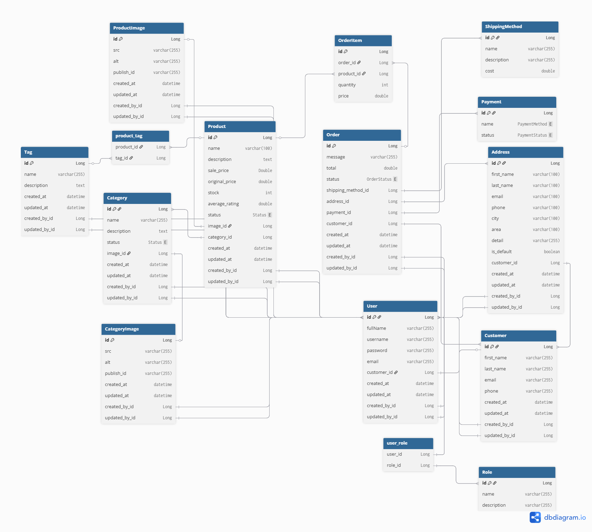

# Báo cáo dự án thực tập - Mini Mart

## 1. Giới thiệu
Mini Mart là ứng dụng web E-commerce dạng demo, được xây dựng trong thời gian thực tập với mục tiêu áp dụng các kiến thức đã học về **Java, Spring Boot, JPA, Spring Security** và thiết kế cơ sở dữ liệu.

## 2. Đặc điểm hệ thống
- **Category**: chỉ 1 cấp, không phân cấp phức tạp.  
- **Product**: không có biến thể (size, màu sắc, tìm kiếm thuộc tính…  ), mỗi sản phẩm chỉ có **1 ảnh chính**.  
- **Order**: gồm các thông tin cơ bản như danh sách sản phẩm, địa chỉ giao hàng, phương thức thanh toán và vận chuyển (mô phỏng, cố định).  
- **User & Customer**: phân biệt thông tin đăng nhập và thông tin khách hàng.  

## 3. Tính năng cốt lõi
- Quản lý người dùng (đăng ký, đăng nhập, thông tin khách hàng).  
- Quản lý sản phẩm và danh mục.  
- Quản lý giỏ hàng.  
- Đặt hàng với địa chỉ, thanh toán, vận chuyển.  

## 4. Ảnh sơ đồ Database

